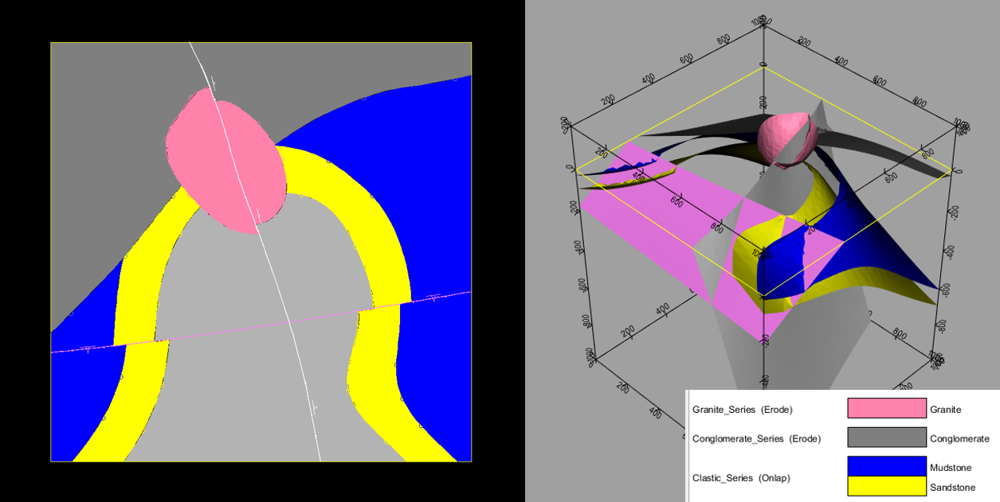
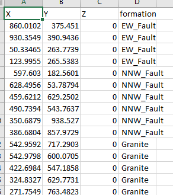
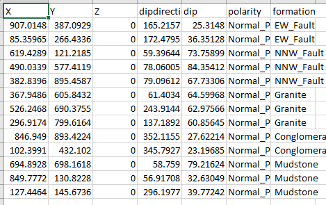

# Examples

## Geomodel_demo

A simple synthetic model for the testing of ensemble generation using implicit modelling techniques.

Geomodel demo is a simple model for testing with LoopStructural
The model consists of two conformable sedimentary formations ("Mudstone" and "Sandstone"), unconformably overlain by another sedimentary layer ("Conglomerate"). All these are intruded by a "Granite". Two faults are present.

The model was originally constructed using Geomodeller. The model file (*Geomodel_demo.xml*) has been parsed by Map2Loop with the model inputs stored in the "*./output*" directory.

### Model parameters

*fault_info.csv*: fault metadata.

*fault_series_topology.csv*: fault and formation/series relationships.

*fault_topology.csv*: fault/fault relationships.

*Geomodel_demo.task_metadata.csv*: project metadata.

*Geomodel_demo.task_petrophsyics.csv*: assigned petrophysics - this project has not had specific petrophysics assigned, so these are default values.

*contacts_clean.csv*: original contact/interface data.

*orientations_clean.csv*: original orientation data (non-perturbed - see below).

*strat.csv*: stratigraphic relationships.

### Ensemble generator outputs
Also in the "*./output*" directory is an ensemble of model inputs generated by the ensemble generator.

#### Contacts
*contacts_n.csv*: contact/interface data version *n*. There are 100 versions of the contact data in this directory.

**Format**

*X, Y, Z, formation*

*perturb_contacts_int_params.csv*: the perturbation parameters used to create the ensemble are stored here for reference.

#### Orientations

*contacts_orient_n.csv*: orientation data version *n*. There are 100 versions of the of the orientation data in this directory.

**Format**

*X, Y, Z, dipdirection, dip,polarity, formation*

*perturb_contacts_orient_params.csv*: the perturbation parameters used to create the ensemble are stored here for reference.
